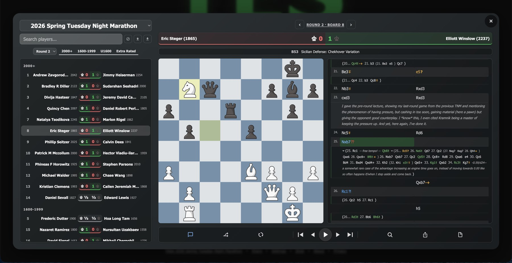

# Are the Pairings Up?

A chess tournament companion for the [Tuesday Night Marathon](https://www.milibrary.org/chess) at the Mechanics' Institute in San Francisco. Live at **[tnmpairings.com](https://tnmpairings.com)**.



## What it does

Every Monday evening, players in one of the longest-running chess tournaments in the US check whether pairings have been posted. This app automates that — and then does a lot more:

- **Push notifications** when pairings or results are posted (Web Push, no app install)
- **Game browser** with tournament/round/section/player filtering
- **PGN viewer** with variations, annotations, comments, and auto-play
- **Opening explorer** with ECO classification from 3,600+ positions
- **Player profiles** with all-time stats and game history
- **Round tracker** showing tournament progress at a glance
- **60-second auto-refresh** — the original feature (automate hitting F5)

## Architecture

Two deployments on Cloudflare, no backend servers:

- **Frontend** — Vanilla JS PWA on Cloudflare Pages. Vite build, zero runtime dependencies.
- **Worker** — Cloudflare Worker for cron-triggered scraping, push notifications, game storage (D1), and tournament state computation.

The worker cron fetches the tournament page, parses standings and pairings, ingests games into D1 with ECO classification, and dispatches push notifications when state changes. The frontend fetches pre-computed state and renders everything client-side.

A Pages Function at the edge intercepts crawler requests to inject dynamic Open Graph meta tags — regular users bypass it entirely.

### Key technical decisions

- **No framework** — vanilla JS, ES modules, ~85 KB gzipped.
- **Server-side state computation** — the worker pre-computes tournament state on a cron schedule. The frontend is a thin rendering layer.
- **Web Push from scratch** — VAPID JWT generation and RFC 8291 payload encryption implemented directly, no push service SDK.
- **Position-based ECO classification** — 3,641 EPD positions from lichess chess-openings, matched by board state rather than move sequence.

## Stack

| Layer | Technology |
|-------|-----------|
| Frontend | Vanilla JS, ES modules, Vite |
| Worker | Cloudflare Workers |
| Database | Cloudflare D1 (SQLite) |
| Hosting | Cloudflare Pages |
| Push | Web Push Protocol (VAPID + RFC 8291) |
| Storage | Cloudflare KV |
| CI/CD | GitHub Actions |

## Development

```bash
# Frontend
npm install
npm run dev          # Vite dev server
npm test             # Vitest

# Worker
cd worker
npm install
npm run dev          # Wrangler dev
npm test             # Vitest
```

## License

[GPL-3.0](LICENSE)
